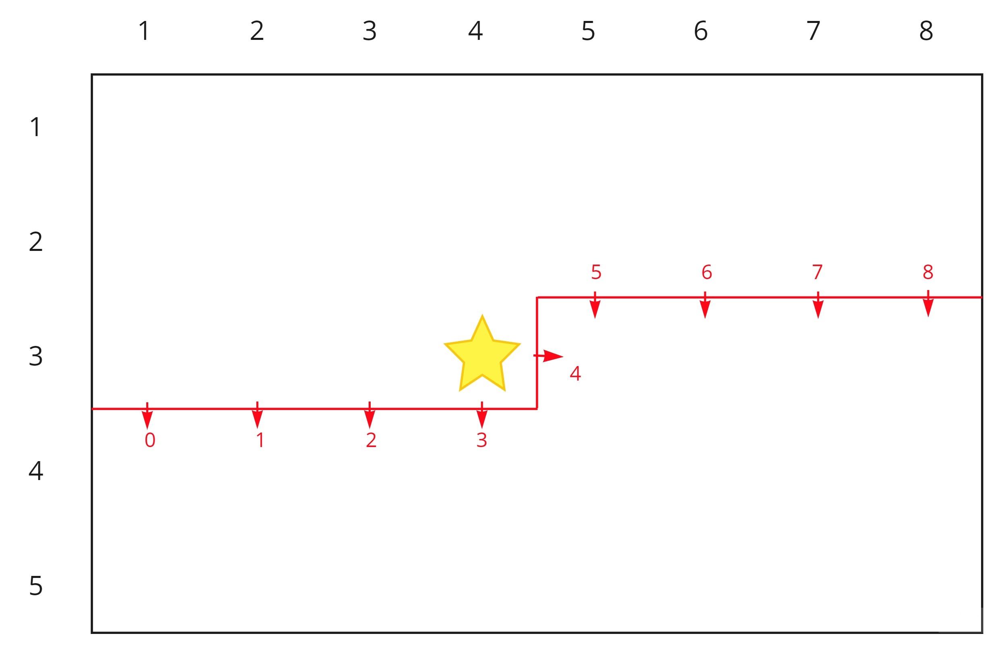
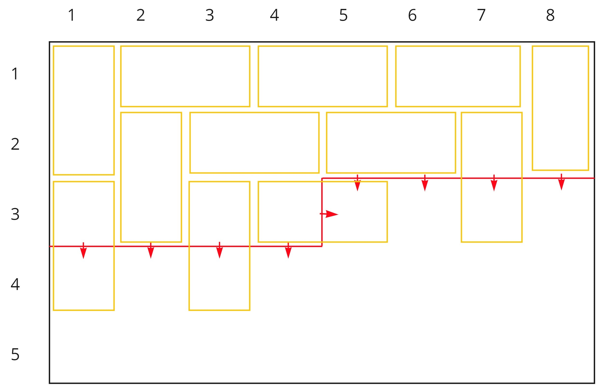
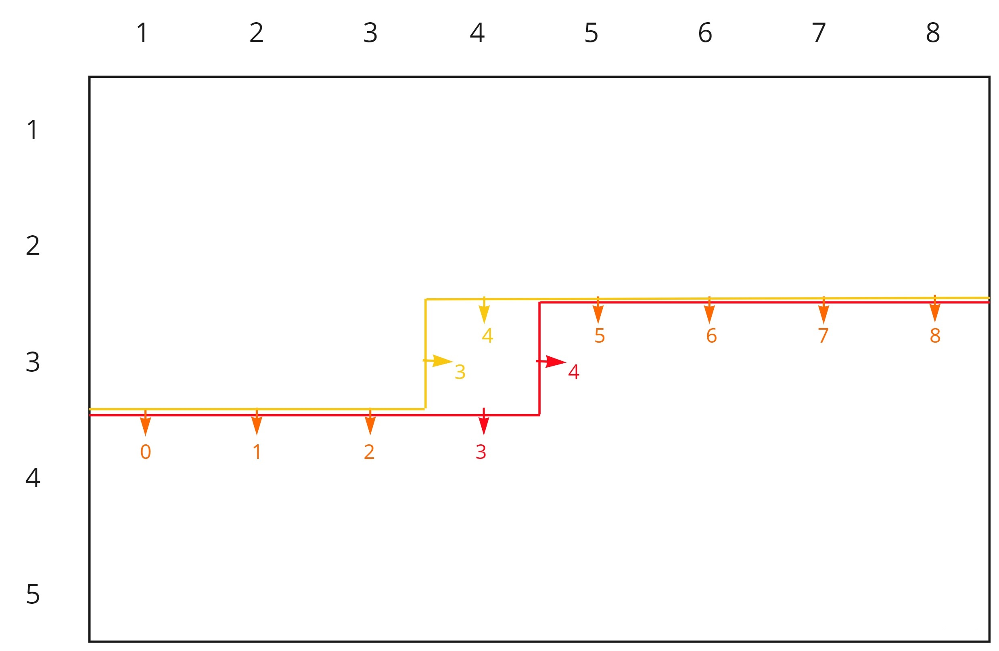

So I realized that there are literally 0 resources written in English on Plug DP, which is one of my favourite DP tricks/techniques that I know of so far. Thus, I hope this serves as a soft introduction for English speakers to this technique, and maybe sheds some light on how powerful it can be. Before we start, I would recommend having a solid understanding of bitmask DP in general in order to get the most out of this blog. Now, let's begin.

### What is Plug DP?

In short, Plug DP is a bitmasking technique that allows us to solve complicated problems with relatively simple states and transitions. To illustrate Plug DP in its most primitive form, let's visit a rather classical problem: **How many ways can we fully tile an $$N \times M$$ grid with $$1 \times 2$$ dominoes?**

This problem can be solved with a standard row-by-row bitmasking approach, but the transitions for that DP state is annoying and unclear at best. Instead, let's investigate an approach that uses a slightly different state. Our state, $$dp[i][j][mask]$$, will represent the number of possible full tilings of all cells in rows $$i-1$$ and earlier, and the first $$j$$ cells in row $$i$$, with a plug mask of $$mask$$. The first two dimensions are relatively straightforward, but what do I mean by "plug mask"?

### The Plug Mask

<figure>

<figcaption>What the state represents</figcaption>
</figure>

Let's consider a concrete example to understand the concept of plug masks. Consider the diagram above, where the first two dimensions $$(i, j) = (3, 4)$$. The red line denotes the line which separates the cells we've already processed and the cells we have yet to consider. This line can be split into $$M+1$$ segments of length 1, and each of the arrows on these segments represent a plug. The plug itself can represent a variety of things, but for our purposes it represents whether we have placed a domino that crosses the plug (i.e. the two halves of the domino lie on separate sides of the plug). The plug will be $$1$$ (toggled) if there is a domino laid over it, and $$0$$ otherwise. For example, the diagram below depicts one of the tilings that has the plugs with states $$[1, 0, 1, 0, 1, 0, 0, 1, 0]$$ from left to right. We can obviously represent the set of states of the plugs using a bitmask of length $$M+1$$, so the DP state which the tiling below belongs to is $$dp[3][4][101010010_2]$$.

<figure>

<figcaption>A possible tiling represented by the binary mask 101010010</figcaption>
</figure>

### Transitions

In general, we want to transition from cell $$(i, j - 1)$$ to cell $$(i, j)$$ (i.e. across each row). Notice that the only 2 plugs change locations when we move horizontally, which is the main reason why Plug DP ends up being so powerful. Specifically, if we number the plugs from $$0$$ to $$M+1$$, then only plugs $$j-1$$ and $$j$$ change locations. Specifically, $$j-1$$ goes from the vertical plug in the previous state to a horizontal plug in the next, while $$j$$ goes from a horizontal plug to the vertical plug. For example, the diagram below depicts the differences between the set of plugs for a state at $$(3, 3)$$ versus the set of plugs for a state at $$(3, 4)$$. The orange plugs are all shared and do not change during the transition, so we only need to consider how plugs $$3$$ and $$4$$ change in our transition from $$(3, 3)$$ to $$(3, 4)$$. It is convenient to note that if we $$1$$-index the columns and $$0$$-index the plugs, then plug $$j$$ will always be the vertical plug when considering a state at column $$j$$.

<figure>

<figcaption>Going from (3, 3) to (3, 4)</figcaption>
</figure>

So how do we transition? First, we notice that if both plugs $$j-1$$ and $$j$$ are toggled from the previous state then it leads to an overlap of 2 dominoes on cell $$(i, j)$$, so we don't need to consider this case. Let's handle the other 3 cases separately.

**Case 1:** none of plug $$j-1$$ and $$j$$ are toggled.

This means that $$(i, j)$$ does not have anything covering it, so we must place one end of a domino there to cover. We can either place a horizontal domino going from $$(i, j)$$ to $$(i, j+1)$$ toggling plug $$j$$, or we can place a vertical domino going from $$(i, j)$$ to $$(i+1, j)$$ toggling plug $$j-1$$. Note that we cannot place a domino going to $$(i, j-1)$$ or $$(i-1, j)$$ since these cells are already occupied by the definition of our state.

**Case 2:** only plug $$j-1$$ is toggled.

This means that $$(i, j)$$ is already covered (by a domino going from $$(i, j-1)$$ to $$(i, j)$$), so all we have to do is untoggle plug $$j-1$$ and move on.

**Case 3:** only plug $$j$$ is toggled.

Extemely similar to the previous case, This means that $$(i, j)$$ is already covered (by a domino going from $$(i-1, j)$$ to $$(i, j)$$), so all we have to do is untoggle plug $$j$$ and move on.

And that's really all there is! Now we just need to handle some special procedures and we are good to go.

### Going from row $$i-1$$ to row $$i$$

If you've been following along, you may be wondering how we go from one row to the next. It turns out that all we need to do is move some values from one place to another. Specifically, when we first process row $$i$$, we will transfer all the values stored in $$dp[i - 1][M][mask]$$ to $$dp[i][0][mask << 1]$$. It may be confusing as to why we are shifting all bits to the left by 1, but the following diagram should clear things up.
