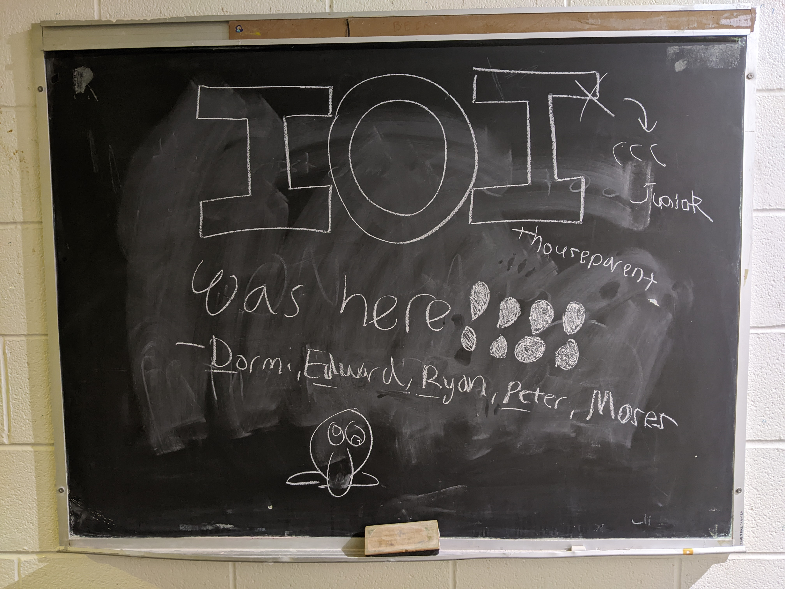
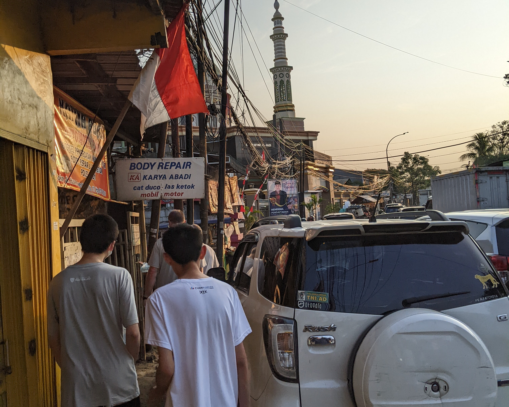
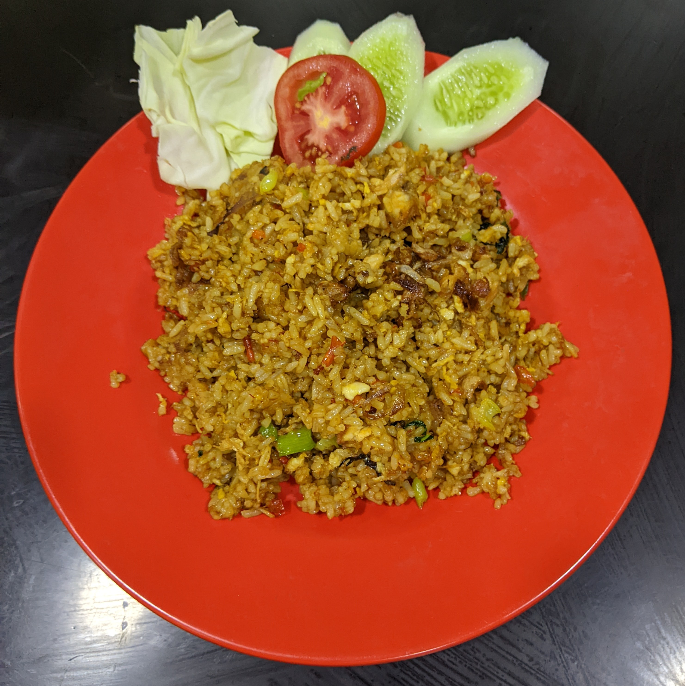
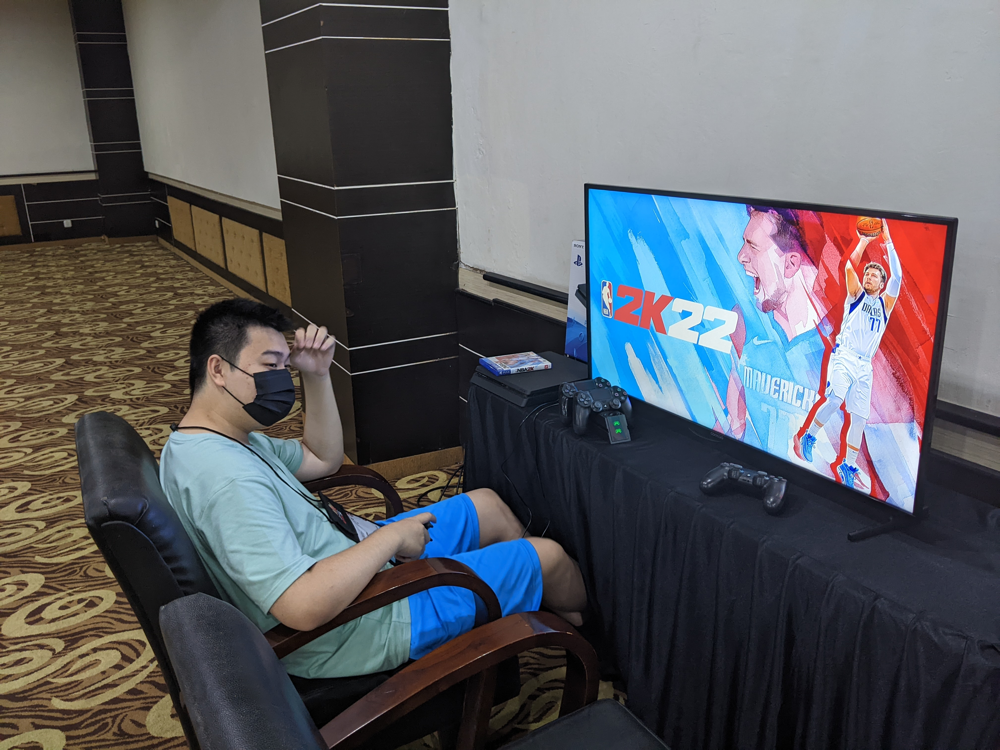
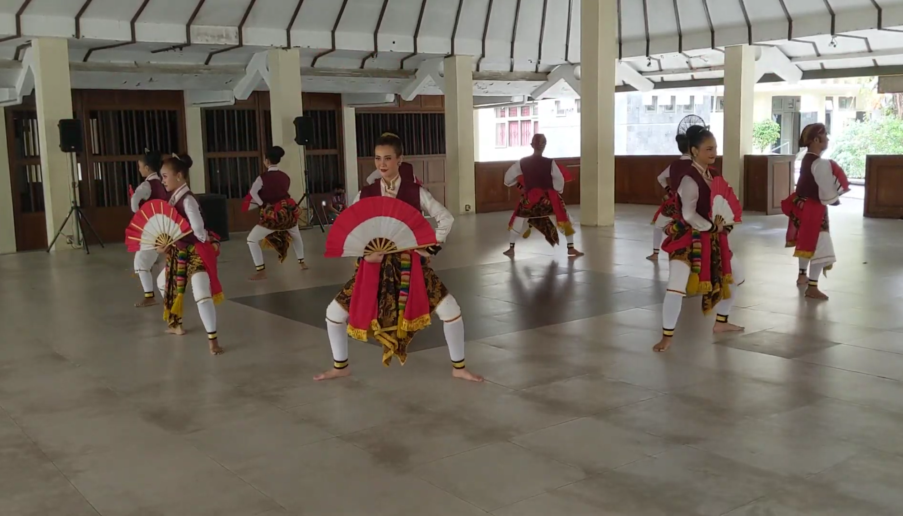
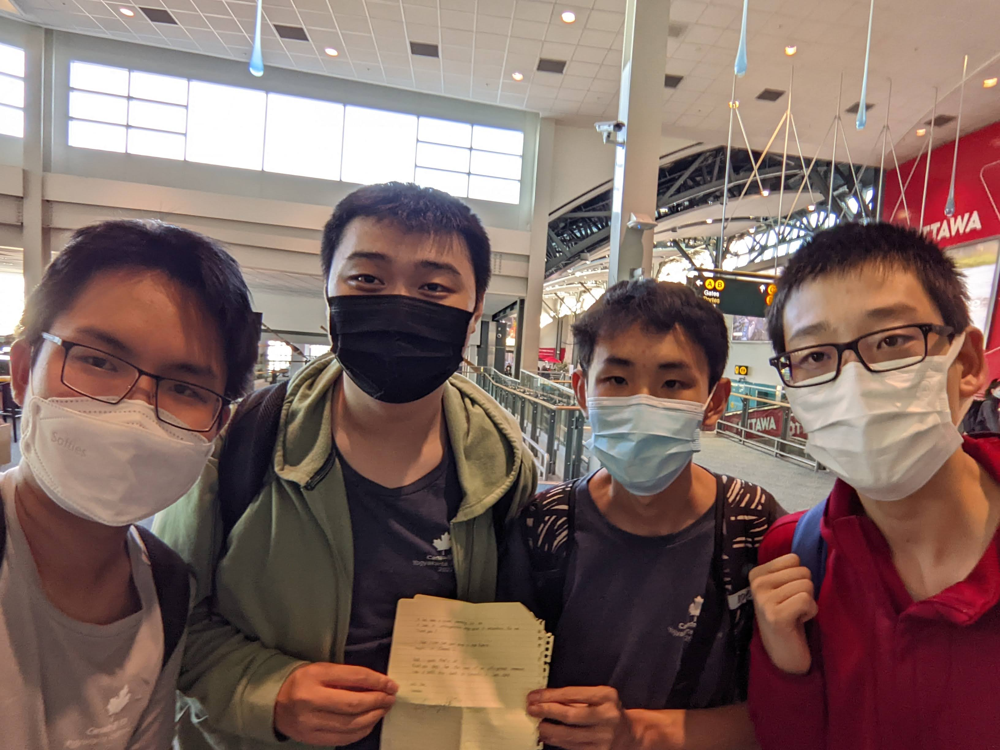

The IOI was a once-in-a-lifetime event which I am extremely grateful to have had the opportunity to participate in. First and foremost, I would like to thank the Canadian leaders for their efforts in making it possible for team Canada to enjoy the full IOI experience this year in person alongside 70 other teams. As I mentioned in the previous post, this post is intended to be a comprehensive rundown and reflection of my experience at the IOI, beginning with the training camp and the journey there. I hope you enjoy!

## Training Camp

To prepare for the competition environment, we (the IOI team members) were invited to attend a training camp for the IOI at the University of Waterloo, taking place around a week before the actual IOI. This was quite a fun part of the journey, as we got the chance to meet each other in person for the first time after already being acquainted online for a long time. We also had the opportunity to meet some friends from Waterloo, such as Moses, Roger, and Keenan. Over the span of 2 days, we were thrown a series of 5 contests, each about 3 or 4 hours long. This was admittedly a little less fun, as the virtual machines we were required to use had massive input delays from both the keyboard and the mouse, making it virtually impossible to see what you were typing. Combined with the time crunch introduced by the "Speed Rounds," the slow VMs made for a frustrating but also entertaining experience. During free time after the barrage of contests ended for the day, we played cards and board games (Scrabble :D), which helped us get to know each other better while still winding down from an entire day of intense focus. 

<figure>

<figcaption>Training camp!</figcaption>
</figure>

## Towards Indonesia

Before I knew it, it was already time to head to Pearson Airport and begin the onslaught of flights to Yogyakarta. Since we were travelling during the pandemic, there were seldom any flights to Indonesia. Thus, our itinerary consisted first of a flight from Toronto to Hong Kong, then a flight from Hong Kong to Jakarta, and finally a flight from Jakarta to Yogyakarta. The flights were anything but boring though, as we spent our time in the air either playing cards, competing in trivia, or working out optimal Othello strategies.

Notably, given how the flights were scheduled, we were forced to take an overnight stay in Jakarta. Furthermore, due to some disturbances in the booking of our intended travel hotel close to the airport, we had to scramble Jakarta for some local hotels and eventually settled with a small one after an hour-long drive that was located in slightly... suboptimal conditions. The streets were narrow and busy, and given that the hotel did not offer complimentary dinner, our only option was to search for nearby restaurants on foot, mere centimetres next to the oncoming traffic! 

<figure>

<figcaption>That's a little close, Peter!</figcaption>
</figure>

After narrowly avoiding being run over for around 10 minutes, we found our first big street-side restaurant and decided to settle with it to avoid having to deal with the traffic any longer. Just when we thought we could take a quick breather, we realized that the menus we were handed were written in pure Indonesian, and the waitress who attended to us couldn't understand what we were saying either! Luckily, a huge sign in the front of the restaurant had pictures of some of the menu items, and most of us settled with what looked the safest: nasi goreng (fried rice). After a brief wait, the food arrived, and it did not disappoint at all! The rice was packed with flavour from the seasoning and the wok hei, and while it was slightly too spicy for some, I found it to be just spicy enough to pack a nice kick that helped me devour the dish in a couple of minutes. As a bonus, the bill totalled to be under $10 CAD for all seven of us, so maybe it was actually worth the chaotic trip there and back! 

<figure>

<figcaption>The first of many nasi gorengs</figcaption>
</figure>

Night soon passed in Jakarta, and after a gruelling 48 hours of travel, we finally set foot in Yogyakarta. The first hotel we visited upon our arrival was the Hyatt Regency hotel, which was nothing short of amazing. The view was spectacular, the rooms were spacious, the reception was immediate, and the food was beyond delicious. 

<figure>

<figcaption>Back view of the Hyatt Regency Hotel</figcaption>
</figure>

There was absolutely nothing not to like about the place... Except for the fact that we wouldn't be staying here for much longer! As it turns out, the Hyatt Regency hotel was only for the team leaders, so the contestants were expected to head to another hotel, the Rich Jogja hotel, located in the city mall, without quite as many top-quality amenities like the Hyatt had. Oh well!

## Days Before the Competition

The schedule of the IOI was designed so that we'd have a couple days to rest and adjust to the new environment before jumping into the actual contest. However, before we could roam around the hotel freely, we all had to do a mandatory round of COVID tests, the first of many to come. Now, having been well-accustomed to my cozy shut-in lifestyle ever since the pandemic started, the only kind of COVID test I had done before was the rapid antigen tests, the ones where you could comfortably swirl it around in the shallow end of your nostrils and be good to go. Now that I had to do the infamous "brain-tickling" PCR test, I was naturally quite nervous. Just as I was trying to comfort myself, I noticed one of the earlier victims of the test was left hunched over to the side, crying and coughing as if he had just been doused in a gallon of pepper spray. Full panic mode reactivated!

Luckily, when it finally got to my turn it was honestly done before I even knew it, defying my expectations of utter horror. After confirming my negative result, it was finally time to drop my luggage off in my room and explore what the hotel had to offer. Partnered with my roommate Allen, we walked down any path that seemed like it led somewhere interesting, passing through the backyard swimming pool, an abandoned fitness room, the rooftop dining halls, and even the IOI committee rooms. As luck would have it, one wrong turn into a private meeting room introduced us to a hotel staff member, who was quick to guide us past an obscure sliding glass door into the game room. Although the game room would become quite populated in the later days of the competition, we were almost definitely the first contestants to explore the venue, as there were still other staff members setting things up in the rooms! The game room was still almost completely empty at this point, and the only game that was properly set up was a PS4 booth with two chairs in front of it. *Perfect*. 

<figure>

<figcaption>Professional gaming</figcaption>
</figure>

Even though neither of us had any experience with the games in the catalogue, we nonetheless spent the next two hours bricking free throw after free throw in 2K22, then sending renowned fighters in drunken brawls to the death in UFC 4. Just like that, the first day had already come to an end. 

The main event of the second day was the opening ceremony. After being shoved onto buses heading to the Indonesian Institute of the Arts first thing in the morning, our arrival was met with warm welcomes from the organizing committee and the university band. The opening ceremony itself was nothing too out of the ordinary, as we sat through musical performances, cultural dances, team introductions, and an abundance of welcoming speeches. What made it the most memorable, though, was none other than the IOI theme song. The song was so impactful that you could hear contestants singing the chorus long after the IOI itself. Truly an unforgettable piece of music. I must urge you to [have a listen](https://youtu.be/DvBNbDiG1Nc?t=1182) yourself, you will not be disappointed.

<figure>

<figcaption>The drums in the middle go ham</figcaption>
</figure>

To pass time for the rest of the day, we figured we would roam the city mall as a team since it was connected to the back of our hotel anyways. The mall was a huge four-storey rectangular complex, with different stores running along each of the four sides. The view from the very top was spectacular, and the aromas from all of the restaurants were still mildly noticeable as you walked along the hallways. We bought snacks (including bubble tea and frozen pudding) from some of the booths we walked past, and we spent some time shopping for souvenirs in the stores. After dinner, we mainly focused on winding down and reviewing lists of essential topics and tricks, trying to clear our minds for the long day ahead of us. The night passed soon after, and it was time for the show to begin.

## Day 1

I still vividly remember the sheer number of washroom trips I had to go on in the hour before the contest started. Although I had gone on a walk outside around the backyard beforehand, the fact that this was the first high-stakes computing contest I had ever written in person made it nevertheless nerve-wracking. The contest venue was a lavishly decorated meeting hall with all of the onsite contestants lined up in an array of workstations, each equipped with the exact same laptop, mouse, and scratch paper. Besides the coding gear, we were also provided with a bottle of water, a plate of snacks, and a pile of convenient signs which we could use to request in-contest essentials such as washroom breaks, technical assistance, and... more banana. The gentle chimes from the softly swaying chandeliers overhead were accompanied by the faint hum of the giant air conditioners as I sat there in complete silence, watching the time on the announcement screens steadily approach one o'clock... The contest had finally begun.

### P2. Prisoner Challenge

After ripping open the contest problems envelope and scanning through all of the problem statements, this was the first one that caught my eye. The problem presented a unique algorithmic challenge in which you are to devise a strategy for a group of prisoners to compare two hidden numbers using only a number on a whiteboard. The catch is that each prisoner may only peek at one of the hidden numbers, and may not communicate with the other prisoners directly. 

To begin paving the path towards a solution, I first considered the most obvious strategy possible: have the first prisoner look at the first number and write it down on the whiteboard, then simply have the second prisoner compare the second number with the number previously recorded on the whiteboard. This does indeed solve the problem, but the issue is that points are allotted based on the largest number written on the whiteboard! To collect more than just the first subtask, we will have to investigate further.

After thinking for a longer while, I noticed that the largest number allowed is around $$2 \log_2 N$$, prompting me to consider strategies based on divide-and-conquer. Eventually, I came up with a solution based on the structure of a segment tree. The general idea is to let the first prisoner be the root node. This prisoner will look at the first number: if it is less than $$N/2$$, they will tell us to go to their left child in the segment tree, and otherwise tell us to go to the right child (by writing the index of the corresponding child on the whiteboard). Following the first prisoner, each prisoner follows a similar strategy. For example, the left child of the first prisoner will first inspect the second number. If the number is at least $$N/2$$, then they can immediately report that the second number is larger. Otherwise, they will signal which child comes next based on whether the second number is less than $$N/4$$. The strategies of all other prisoners are analogous. 

Since every non-negative integer written on the whiteboard is the index of a node in the segment tree, the largest number written is simply the number of nodes in the segment tree (minus one, to be precise). Although this would be approximately $$2N$$ naively, compressing all nodes in each layer into a single node helps reduce this number drastically to approximately $$2 \log_2 N$$. Implementing this solution gave me 60/100 points for just over an hour of work, something I was extremely excited about. At my current rate, I should have enough time to approach a full solution on this problem while also scoring good partials on the other two! Since I had already come so far, I decided to try and go for even more points here, especially since even the most minute optimizations at this point could mean a big score difference.

I continued my work on this problem first by considering whether I could optimize the root node, since it seemed like the least efficient use of information in the network so far. After not having luck with that for a while, I tried optimizing the leaf layers of some asymmetric segment trees. This also proved to be futile, however, since $$N=4096$$ results in a perfect binary tree structure. At this point, I briefly considered trying out a different number of children (perhaps 3 or 4 would work better?). However, after somehow convincing myself that $$f(b) = b \log_b N$$ is a constant function (it is most certainly not!), I tossed this thought aside as well, never to return to it again. Nothing I thought of seemed to work, so I readily moved on to the next problem.

### P3. Radio Towers

This was the next problem I tried, since it seemed easier to get started on than Catfish Farm. It appeared to be a traditional heavy data structures task, as the problem asks you to answer several weird range queries on a fixed array. My first reaction is usually to think about Mo's algorithm when dealing with these types of problems, but the fact that the queries were given online in the form of function calls ruled out this possibility. After a while of failing to come up with any major observations that could significantly simplify the problem, I decided to start with the smaller subtasks and see how far I could take them.

The solution to the first subtask came quickly. After all, it is clear that you cannot select more than one tower from a monotonically increasing or decreasing sequence, so the problem really just boils down to checking if you can take two towers, one from each side of the peak at $$k$$.

The next two subtasks were more demanding, since they asked for an algorithm to solve the entire problem for a single query. Initially, I tried to bash out the query conditions using DP, but this did not feel viable in the long term as I couldn't even begin to think about how one would optimize the transitions to work in linear time, much less sublinear time per query. Now stepping back a bit to think about the problem from a different perspective, I realized that the queries were essentially asking for the longest up-down subsequence in the array where consecutive elements of the subsequence differ by at least $$\delta$$. Indeed, such a subsequence corresponds to an optimal selection of towers by selecting only the valleys and using the peaks as intermediary towers. This was a much simpler specification than the one given in the problem statement, with many possible implementations as well. I chose to promptly convert this idea into a solution using monotonic stacks, solving each query in $$\mathcal{O}(N)$$ time. 

At this point, I had accumulated 27 points on the problem but was confused regarding how I could take my solution further when faced with multiple queries. My new specification wasn't as extendible as I hoped it could be, as the optimal sequence could change considerably given different endpoints and would definitely change completely when given different $$\delta$$ values. I spent the next half an hour playing around with various greedy ideas, but none of them bore any fruit when tested against the full problem data. Now more than halfway through the contest, I decided to finally return to the first problem I read: Catfish Farm.

### P1. Catfish Farm

To be honest, I was glad to see this problem on the contest initially, since its unconventional nature led me to think that it was an ad hoc problem. However, after looking at it for a longer while, I realized that the correct approach was almost definitely DP... by far my weakest problem type! Regardless, I knew I had to squeeze as many points as I could out of this problem after suffering a large delay from Radio Towers.

The first subtask was extraordinarily easy, as it was essentially asking for the sum of all numbers in the grid. The second subtask also seemed like it would be a breeze, since there were only two possible $$X$$ values. Obviously building two piers could never be optimal since the shorter pier would just be an obstruction to the taller one, so we could just take the maximum of placing a full pier in column 0 and column 1. Right? Haha, no. After almost half an hour of checking for implementation mistakes, off-by-one errors, and integer overflows, I still couldn't figure out just what could be causing my solution to get wrong answer on a seemingly random test case in the second batch. Annoyed by the fact that my convincingly correct solution was failing again and again, I decided to ignore this subtask and have a go at the later ones first.

The third subtask was much easier to handle, since the constraint on $$Y$$ essentially reduced the problem to a simple 1-D subsequence DP. The key observation was that the states of the relevant catfish (free, covered, or already taken) depends only on the piers in the last two columns, reducing the number of states to just $$4N$$. Luckily, this observation carries over to the next couple of subtasks too, since we only need to consider pier heights where there is a catfish in one of the neighbouring piers at that height. Extending the state to capture all of these new possibilities leads to a $$\mathcal{O}(N^3)$$ solution, and I managed to claim subtasks 3, 4, and 5 in one fell swoop (well, disregarding the implementation and debugging, among all else).

By now there were just over 20 minutes remaining on the clock, and I was reinfused with hope since solving subtask 2 and subtask 7 would net me over half of the total points available from day 1. Both subtasks seemed achievable, since I was sure subtask 2 was just a small bugfix away and I could easily modify my code for subtask 5 to work for subtask 7. However, things did not go as smoothly as I wished they would. I worked on my subtask 7 solution first, and after about 15 minutes of local debugging, it was ready for submission. After running for a minute or so, I was shocked to see that it had gotten wrong answer on one of the cases. Confused, I rushed back to my source code and increased a couple of the constant values in my nested loops to 10 in order to ensure that I was accounting for all of the possible pier heights. The new code ran on the judge until less than 30 seconds were remaining, after which it displayed the most dreadful verdict of them all — Time Limit Exceeded. With too little time to make any further adjustments to my code, I was left with no option but to walk away with only 134 points from day 1 when I knew I could've gotten more.

### Reflections

Soon after the contest ended, we gathered as a team outside the contest hall to discuss our performances. To my dismay, I learned from Peter that the full solution to Prisoner Challenge was based on some small optimizations on a ternary segment tree, something I had absolutely considered during the contest! Simply replacing the binary structure with a ternary structure would have netted me multiple extra subtasks, so I was extraordinarily angry at myself for rejecting the idea outright while the contest was still live. Furthermore, later in the day when we were allowed to re-enter the contest hall to make submissions in analysis mode, my heart sank when I learned that just changing all of the 10s in my code to 7s would have been enough for the last submission I made to Catfish Farm to pass subtask 7.

In short, my mistakes during day 1 were twofold. Firstly, I should not have thrown out the base change idea for Prisoner Challenge so carelessly, without actually verifying my convictions beyond some naïve hand calculations. In doing so, I had cut off the only path toward further progress and tricked myself into believing that I was at my wits' end. Secondly, I should not have been fixated over the weird 6-point subtask from Catfish Farm for so long and overcommitted to finding a bug in my code when no such bug existed. This prevented me from allocating more of my time to the later subtasks, where I had a better idea of what was going on and each subtask was worth more than double the points. Anyways, I sure hope missing those 14 points from Catfish Farm by a couple of seconds doesn't matter too much at the end of the day...

## Day 1.5

This day started off in a way that was by no means relaxing. We were once again packed into buses first thing in the morning headed for the Indonesian Institute of the Arts, this time to engage in miscellaneous physical activities as part of an excursion. Our randomly assigned physical activity was traditional Indonesian dancing, and we were put in the same group as the American team and the Japanese team, the two best-performing onsite teams. It was a blast getting to know the other teams better through a common group activity. We all enjoyed chatting with the American team, and Ryan had his own idea of how we should greet the Japanese team (in the form of him shoving me in front of them and forcing me to speak Japanese, and me making a fool of myself by not knowing what to say), although I'm not sure I enjoyed the latter part as much...

<figure>

<figcaption>Students from the ISI performing a traditional dance</figcaption>
</figure>

After the dance session, we were led to an extravagant dining hall for a special lunch accompanied by live instrumental band music. There, we saw the widest selection of authentic Indonesian cuisine thus far, and I made sure to capitalize on that by taking a small sample of every dish they had to offer. Unfortunately, I failed to realize that it might not be the best idea to mix dozens of different foods together all at once, which led to me spending the next half hour camping out in the nearest washroom. Definitely a learning experience to keep in the mind for the future too.

By 3:00 in the afternoon, we were back at Rich and once again left with an abundance of free time, not knowing what to do. I spent most of that time either lying on my bed, going for random walks in the hotel, or playing Cambio with the team, letting my mind and body relax to maximize my performance for tomorrow. Night soon fell once again, and it was time to face the second half of the contest back in the contest hall.

## Day 2

### P6. Thousands Islands

The problems in this set were just as confusing as those from day 1. Usually, the IOI likes to include one task that most contestants are able to fully solve or at least make significant progress on (e.g. Mutating DNA from 2021 and Connecting Supertrees from 2020), but it seems like they decided to completely skip out on that this year. Alas, it was time for me to head straight to partial farming once again.

Thousands Islands looked to be the hardest problem of the entire set, as it stood out with its simple yet confusing premise. Luckily, its subtasks were much more approachable, so I started the contest with a focus on grabbing those first. The first subtask, $$N=2$$, only required the simple observation that at least two canoes must face forwards (since a single canoe cannot be used twice in a row) and one canoe must face backwards to make a full round trip between the two islands. The next subtask had a separate setup, with a complete graph where each edge has exactly one boat in each direction. Although this meant that $$N=2$$ was no longer possible, any graph with at least $$3$$ islands had a valid trip since there was a simple maneuver involving four boats connecting any three islands. Luckily, this maneuver also extended itself to the general bidirectional setup, since it implies that a valid trip exists as long as there is a path from the starting island leading to an island with at least two unexplored neighbours (necessity is also intuitively obvious, considering the case with a line graph). All in all, this worked out to be the first 31 points of the problem.

The next 24 points were also within my reach. It presented a similar setup from the previous subtask, except this time both boats of an edge face the same direction. My new idea was to use any cycle in the graph as a wrap-around for the trip, since any cycle could be reset by traversing all the first boats, traversing all the second boats, resetting the first boats, and then resetting the second boats. Thus, as long as there was a reachable cycle in the graph, you could simply traverse to the cycle, make a U-turn, and then go back to the starting island. On the contrary, no round-trip can exist if there are no reachable cycles, since the trip will always get stuck at some island without any outgoing boat. In short, the subtask boiled down to simple cycle finding in a directed graph. Easy, right? This can be implemented in linear time using a naïve DFS that keeps track of previously visited islands.

Unfortunately, this is where problems started occurring again. For a completely unknown reason, I was yet again facing a wrong answer verdict when submitting to this problem, giving me flashbacks to my struggles with subtask 2 of Catfish Farm. Even though the code was also only a couple dozen lines long, I still could not for the life of me figure out what the issue was. Now that the weight of the subtask was even higher, I found it much harder to move on from the code and ended up getting stuck watching over an hour of time dwindle away, unable to determine what could possibly be causing the issue. 

### P4. Digital Circuit

Now significantly behind on time, I knew I needed to come up with as many subtask solutions as quickly as possible if I wanted a chance at redeeming my performance. Since the scoring distribution on Rarest Insects was not as friendly, I turned to Digital Circuit first in search of salvation. I was actually really surprised to discover that Digital Circuit was a counting problem, since they were never featured on the IOI before (at least not in the last few decades). By no means was this a pleasant surprise for me though, since this almost definitely meant that the solution had something to do with DP...

The first three subtasks all shared the common constraint $$Q \leq 5$$, which essentially means that we only have to work with static trees. This turned out to be relatively simple. If we define $$dp[i][j]$$ to be the number of ways for the $$i$$-th gate to have state $$j$$, then the transitions only need to account for the number of activated (state $$1$$) children, which can be done with tree knapsack DP. As the author of both [this](https://dmoj.ca/problem/dmopc21c1p4) and [this](https://dmoj.ca/problem/dmopc21c2p5), I was pretty comfortable with implementing tree knapsack and managed to collect the first three subtasks on the first go. 

The next two subtasks required proper handling of range updates, but have the extra condition that the tree is a perfect binary tree. Clearly, range updates can be performed efficiently in this case using lazy propagation on a segment tree. If we work out the explicit transitions from the DP before for only two children, we see that the formulas for $$dp[i][0]$$ and $$dp[i][1]$$ are actually symmetric with respect to each other. Thus, we can propagate the lazy update flag by simply swapping the two values, and the rest follows naturally. Implementing this idea also only took around 10 minutes, so I ended up earning 34 points from Digital Circuit in the span of around half an hour.

I wanted to push further on this problem given how fast the foundational ideas came to my mind, but the harder subtasks required handling range updates on an arbitrary tree structure which I was not too familiar with in the context of recomputing DP values. Combining this challenge with my significant time investment on Rarest Insects for only 10 points so far, I decided it would be wisest for me to dedicate the rest of my time to getting as much as I can out of the latter problem.

### P5. Rarest Insects

This was a problem which I thought about on and off throughout the entire contest window. Its interesting interactive premise had me thoroughly intrigued (I am a huge sucker for good interactive problems), so I had it constantly burning at the back of my mind. In short, the problem allows you to insert and remove insects from a machine, or activate the machine to count the cardinality of the most common insect type in the machine. The goal is to efficiently determine the cardinality of the rarest insect type overall.

The most obvious solution is to figure out the types of each insect relative to each other, and then explicitly count the least frequent type. In order to do this, for each pair of insects we can add it into the machine and then immediately activate it. If it returns 2 then the insects are of the same type, and if it returns 1 then they are different. This approach requires at most $$N(N-1)$$ operations of each type, which is enough to get the first 10 points of the problem. 

Beyond the super basic approach, I was stuck when trying to come up with ideas which took significantly fewer operations. I was pretty hooked on trying for a square root-based idea where I can systematically ignore the more common insects, but nothing of value came from that train of thought. The optimal bound of $$3N$$ operations also led me to believe there would be some type of constant multi-pass solution to the problem, but it was clear after a while of thinking that this would not be useful beyond simply determining the cardinality of the most common insect type or the number of distinct insect types.

Luckily, inspiration hit during the last hour of the contest when I decided to go all in on this problem. I realized that knowing the number of distinct insect types (obtainable via a single pass through the insects) was conducive to a binary search solution! Indeed, let's say the number of distinct insect types is $$D$$, and we want to determine whether the cardinality of the rarest insect type is at least $$lo$$. To do this, we can add the insects one by one to the machine, each time activating the machine to check that the most frequent insect type does not exceed $$lo$$ (remove the insect if it does). If by the end of this process we have exactly $$D \times lo$$ insects in the machine, then we know that there are at least $$lo$$ insects of each of the $$D$$ types, so the cardinality of the rarest insect type is at least $$lo$$. On the other hand, if we have less than $$D \times lo$$ insects in the machine, then we know that some of the insect types have less than $$lo$$ insects, so the cardinality of the rarest insect type is less than $$lo$$. This check leads directly to a binary search solution terminating in $$\mathcal{O}(\log N)$$ iterations. Since each iteration is a single pass through the insects using $$\mathcal{O}(N)$$ operations, the solution uses $$\mathcal{O}(N \log N)$$ operations of each type overall. 

Directly implementing my binary search idea was short and sweet, boosting me directly to the 50 point mark. I felt like I was close to the full solution idea after spending so much time on this problem, but the fact that there were only 20 minutes remaining on the clock made going for smaller constant optimizations the best bet to realistically increase my score. Checking the edge cases (where the rarest cardinality is $$1$$ or $$N$$) separately helped boost my score up to 53.81. To squeeze even more points out of the problem, I decided to do separate checks for when the number of distinct insect types is low. This optimization significantly decreases the range of the binary search and helped increase my score to 57.14. At this point, I was seriously running out of time and did not manage to clinch any further optimizations for submission. This left me with 122.14 total points from day 2, once again a score I did not feel satisfied with at all...

### Reflections

After the contest had fully ended, I was devastated to learn that my overall rank of 91 put me so close to but on the wrong side of the silver-bronze cutoff. The cutoff for a silver medal turned out to be 257.80, which meant my final score of 256.14 put me a measly 1.66 points away from getting silver! Those 1.66 points could have come from any of my inexplicably silly mistakes, whether it be the second or seventh subtask of Catfish Farm, the fourth subtask of Thousands Islands, or even just a slightly better constant optimization on Rarest Insects. The fact that I had managed to mess up on each and every one of them meant that I had to settle for a bronze medal when I knew I had the potential to do much better. That night, I had completely lost my usually high energy due to the excruciating frustration I felt towards myself and my performance.

So what was my biggest weakness at the IOI? Definitely implementation. Although my ideas for each of the subtasks I missed came quickly, I lost significant time and score due to my poor implementation skills. To be completely honest, I am still unsure as to what the exact cause of my poor implementation at the IOI was, since I had never identified implementation to be one of my weaknesses in previous training contests among all else. My best guess would be my unfamiliarity with the coding environment provided at the IOI, where I had to use Sublime and the terminal to test my code instead of my usual CLion setup. Not being completely comfortable with my coding environment was admittedly so much more off-putting than I expected it to be, given that the IOI was the first onsite coding competition I had ever participated in. If I was given the chance to redo my training for the IOI, I would dedicate a lot more effort into ensuring that my practice environment was as similar to the actual contest environment as possible so that there are fewer adjustments to make and fewer unpleasant surprises to deal with.

## Conclusion

Although I cannot say I am completely happy with my performance, I am still extremely grateful to everyone who helped organize and contribute to the event. The problems were undoubtedly high quality as usual, and I am still especially in love with the full solution to Rarest Insects even though I did not have enough time to come up with it in the actual contest. I sincerely treasure all of the opportunities we were given to connect and bond with like-minded competitors from all across the world, whether that be through an intense match of table tennis in the hotel game room or through running together from the pouring rain on the many beautiful outdoor excursions.

To my team and my coaches, I want to say thank you for accompanying me on this bizarre week-long trip to Indonesia. You guys are some of the nicest and brightest people I have ever met, and I truly felt our connection as a team. Whether it be pinning memes to Richard's office, getting yelled at for playing BS poker too loudly on the plane, or laughing uncontrollably at an ice cube melting off a straw, I will never forget all the wild antics we've been through together. Now that all but one member of the team are off to university, I'm excited to see what the future holds in store for us and the next generation of Canadian high school competitive programmers. Go Team Canada!

<figure>

<figcaption>Shoutout to Vanessa for being the most wonderful tour guide!</figcaption>
</figure>
